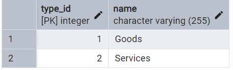
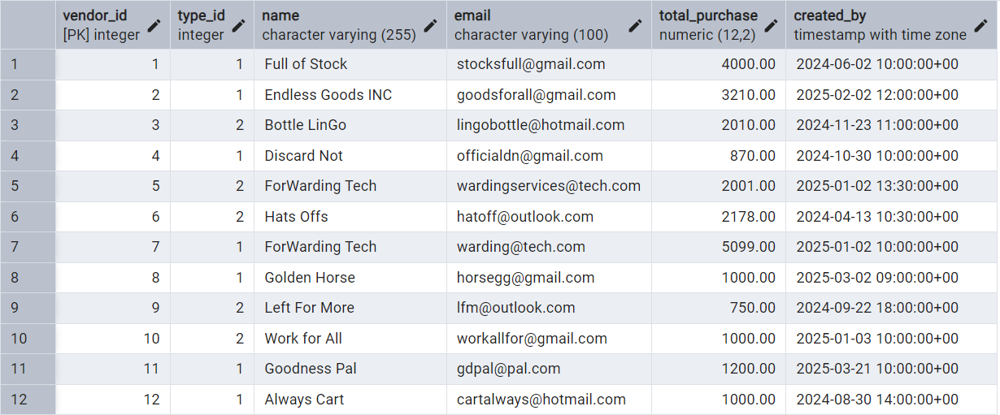

# This is the Backend of the CRUD Web Application that has a developed filtering system

For the Full Stack Application, Express with a PostgreSQl Database was used for the Backend.

It will detail the features, database and packages used, which includes details of the PostgreSQL Database and Express Server.

Repository of the Angular Frontend for this application: https://github.com/Swasbuckler/filter-search-crud-angular

Repository of the React Frontend for this application: <i>Work in Progress</i>

I will return to working on this project at a later date, as I wish to focus my attention to other interested projects.

## What have I Achieved and Learnt through this Project

Through the development cycle of this project I have learnt a lot of key concepts related to Angular, Express and PostgreSQL.\
For Express specifically, I have developed the Backend Server roughly using the Model-View-Controller (MVC) architecture. Although it is not exactly following MVC, it helped guided me in creating a file structure that helped in development clarity. Using this structure, in an environment where it was not neccessary taught me the significance of setting an architecture and how it helps in development. I hope to carry over this understanding when planning for future projects.

For PostgreSQL, this was the first time I had used and experienced managing a PostgreSQL database in a Personal Project. I have learnt a lot in terms of database communication with the backend server as well as the differences it has to MySQL. In the case where I have to use PostgreSQL for other projects in the future, I hope to used this gathered knowledge.

One of the major challenges I had faced in development was handling Project Scope and Requirements.\
Initially this Application was envisioned to be part of a larger Full Stack Application as I wanted to create an Inventory management Application. However due to the Project Timeframe I had given myself and the large number of Bugs encountered which expectedly lead to Delays. Thanks to this I had Restructured this project 3 times, cutting down the Project Scope and Requirements each time.\
With this experience, I now know how to better plan for future projects with a set Timeline even if the Project was a Personal Project that does not have strict guidelines.

In the end, I was able to develop a full stack application that was able to meet my satisfaction and final requirements.

### Included Features

1. C.R.U.D | Application includes all CRUD Actions 
2. Filtering System | Application includes customizable filters
3. PostgreSQL Database | Application includes Seeding, Dropping and Manipulating the Database

### Excluded Features

1. User Login | Was Out of Scope
2. Charts and Graphs | Was Out of Scope

## Packages Used for the Backend

1. Express | For the Backend Server
2. Luxon | For Datetime management
3. pg | For communication to PostgreSQL Database

## Main Features of the Application

### C.R.U.D & Filtering System

The functionalities of the CRUD and Filtering System was designed to be modular where given a use case with a specific table in the database, the same functions are able to be used to provide the same features.\
The Frontend UI for the C.R.U.D and Filtering System can be seen in the respective Frontend Repositories.

### PostgreSQL Database

The database was seeded with data related to seed Vendors for an imagined business.\
There is a singular database with 2 Tables. One for holding the Types of Vendors and the other to hold all of the data of the Vendors.

\
The image of the "vendor types" table.

\
The image of the "vendors" table.
